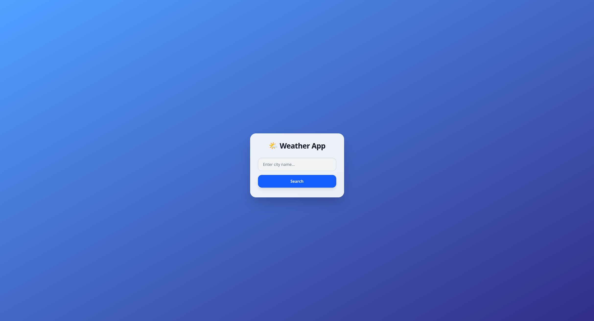

# 🌤️ Weather Web App

A sleek, responsive, and lightweight Weather Application built with **Vanilla JavaScript**, **HTML5**, and **Tailwind CSS**. It uses the **Open-Meteo API** to search for locations and display real-time weather information through a clean and minimal interface.



🔗 Live Demo: [[Weather Web App](https://YOUR-LIVE-DEMO-URL.vercel.app/)](https://weather-web-app-woad-six.vercel.app/)


---

## ✨ Features

- 🔍 **City Search**: Search for a city and retrieve its geographical information.
- 🌡️ **Current Temperature**: Displays the current temperature for the selected location.
- 💨 **Wind Speed**: Shows the current wind speed.
- ☁️ **Weather Condition**: Displays the current weather condition based on the WMO weather code.
- 🌍 **Location Information**: Shows the selected city, country, and timezone.
- 📱 **Responsive Design**: Optimized for desktop, tablet, and mobile screens.
- ⚡ **Vanilla JavaScript**: Built without React or other JavaScript frameworks.
- 🌐 **Open-Meteo API**: Uses Open-Meteo for geocoding and weather data.

---

## 🛠️ Tech Stack

- **HTML5**: Semantic document structure.
- **Tailwind CSS**: Utility-first CSS framework for styling.
- **Vanilla JavaScript (ES6+)**: API requests, DOM manipulation, and application logic.
- **Open-Meteo API**: Geocoding and weather data.

---

## 🔌 API

This project uses the [Open-Meteo API](https://open-meteo.com/) to retrieve weather and location data.

### Geocoding API

Used to convert a city name into geographical information such as:

- City name
- Country
- Latitude
- Longitude
- Timezone

### Weather API

Uses the latitude and longitude to retrieve:

- Current temperature
- Wind speed
- Weather code
- Hourly weather data

---

## 📁 Project Structure

```text
Weather-Web-App/
├── assets/
│   ├── js/
│   │   └── app.js          # Main application logic & API handling
│   │
│   └── style/
│       ├── input.css       # Tailwind CSS source file
│       └── output.css     # Compiled CSS stylesheet
│
├── index.html              # Main HTML document
├── package.json            # Project dependencies & scripts
├── package-lock.json       # Dependency lock file
└── README.md               # Project documentation
